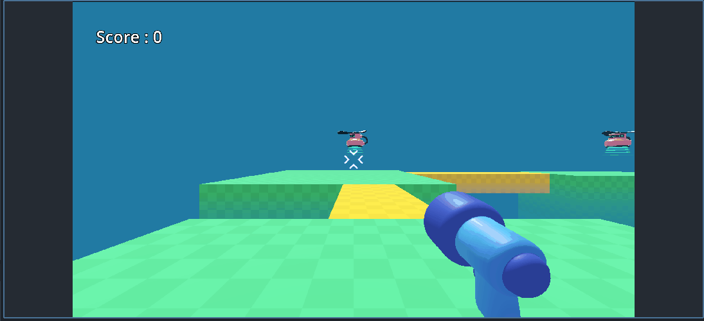

# GDQuest - Survivor Arena FPS

## Features

### Player Control

- `LMB` to Shoot enemy
- `W`, `A`, `S`, `D` to move around
- `Space` to jump

### Mob

- Mob that follow you when they spawn
- Mob spawns at dedicated spawner
- Mob have spawn and dead particles in it

## Gameplay

## Links

- [GDQuest](https://www.gdquest.com/library/first_3d_game_godot4_arena_fps/)
- [Youtube](https://youtu.be/NJJNWGD25rg?si=7CmOZM4imKk_HPOU)